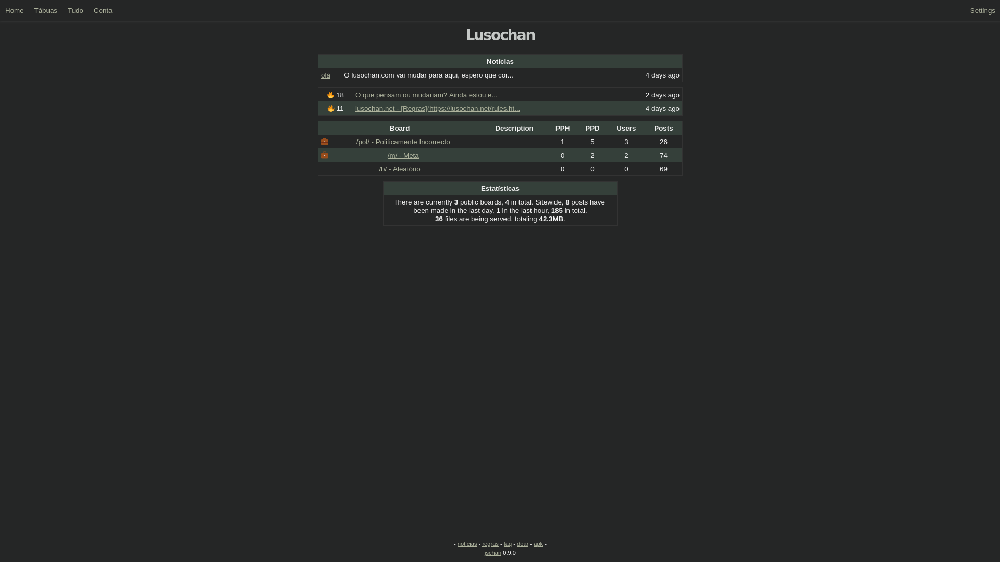

<h2><a href="https://gitgud.io/fatchan/jschan"><strong>jschan</strong></a> | <a href="https://lusochan.net">lusochan</a></h2>

<<<<<<< HEAD
=======
Live instance: https://94chan.org
>>>>>>> 4b396393dac503ad4592d79a9a5369ae9b32d307

<<<<<<< HEAD
mais um chan português
 
 <ul>
  <li>utilizadores podem criar t&aacute;buas</li>
  <li>m&uacute;ltiplos ficheiros por poste - 50MB total</li>
  <li>desenhos Tegaki</li>
  <li>bonitos estilos, temas e cores</li>
  <li>bastantes recursos disponiveis para o utilizador</li>
</ul> 
=======
API documentation: [fatchan/jschan-docs](https://gitgud.io/fatchan/jschan-docs/) - Gitgud pages link: https://fatchan.gitgud.site/jschan-docs/#introduction
>>>>>>> 4cbac793f3857518e9f848108ab104c7430e98ed

 
 

<<<<<<< HEAD

=======
## Features
- [x] User created boards ala [infinity](https://github.com/ctrlcctrlv/infinity)
- [x] Multiple files per post
- [x] Antispam/Anti-flood & DNSBL
- [x] 3 customisable inbuilt captchas + 2 third party captchas (hcaptcha & recaptcha)
- [x] [API documentation](https://fatchan.gitgud.site/jschan-docs/)
- [x] Built-in webring (compatible w/ [lynxchan](https://gitlab.com/alogware/LynxChanAddon-Webring) & [infinity](https://gitlab.com/Tenicu/infinityaddon-webring))
- [x] [Tegaki](https://github.com/desuwa/tegaki) applet with drawing and replays
- [x] Two factor authentication (TOTP) for accounts
- [x] Manage everything from the web panel
- [x] Detailed accounts permissions system
- [x] Works properly with anonymizer networks (Tor, Lokinet, etc)
- [x] Beautiful bundled frontend with lots of themes and options, see below:
>>>>>>> 4cbac793f3857518e9f848108ab104c7430e98ed

<<<<<<< HEAD
=======

## License
GNU AGPLv3, see [LICENSE](LICENSE).

## Installation & Upgrading
See [INSTALLATION.md](INSTALLATION.md) for instructions on setting up a jschan instance or upgrading to a newer version.

## Changelog
See [CHANGELOG.md](CHANGELOG.md) for changes between versions.

## Contributing
Interested in contributing to jschan development? See [CONTRIBUTING.md](CONTRIBUTING.md) for contribution guidelines.

## Related Projects
Here are some other projects related to jschan that you might find useful. **These are not official or otherwise guaranteed to work or be safe and should be used at your own risk.**
 - [fatchan/jschan-api-go](https://gitgud.io/fatchan/jschan-api-go) - WIP Golang API Client for jschan.
 - [ussaohelcim/jschan-api-sdk](https://github.com/ussaohelcim/jschan-api-sdk) - JavaScript/TypeScript SDK for jschan.
 - [ussaohelcim/jschan-api-types](https://github.com/ussaohelcim/jschan-api-types) - TypeScript typings for jschan API.
 - [myumyu/globalafk](https://gitgud.io/myumyu/globalafk/) - "A simple python script that sends ugly notifications when something happens on a jschan imageboard that you moderate."

## For generous people

Bitcoin (BTC): [`bc1q4elrlz5puak4m9xy3hfvmpempnpqpu95v8s9m6`](bitcoin:bc1q4elrlz5puak4m9xy3hfvmpempnpqpu95v8s9m6)

Monero (XMR): [`89J9DXPLUBr5HjNDNZTEo4WYMFTouSsGjUjBnUCCUxJGUirthnii4naZ8JafdnmhPe4NP1nkWsgcK82Uga7X515nNR1isuh`](monero:89J9DXPLUBr5HjNDNZTEo4WYMFTouSsGjUjBnUCCUxJGUirthnii4naZ8JafdnmhPe4NP1nkWsgcK82Uga7X515nNR1isuh)

Oxen (OXEN): `LBjExqjDKCFT6Tj198CfK8auAzBERJX1ogtcsjuKZ6AYWTFxwEADLgf2zZ8NHvWCa1UW7vrtY8DJmPYFpj3MEE69CryCvN6`
>>>>>>> 4b396393dac503ad4592d79a9a5369ae9b32d307
